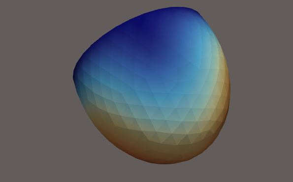
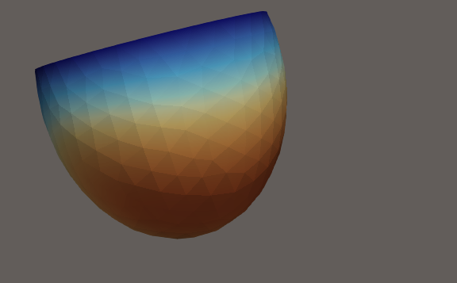

# PDE_project

Finite-element nonlinear cardiac mechanics implementation.

## What this repo contains

- A parallel deal.II code that solves a nonlinear equilibrium problem using a Newton method with backtracking line search.
- A vector-valued displacement unknown $u \in \mathbb{R}^3$ (3D).
- A hyperelastic material implemented via automatic differentiation (AD): energy density $W(F)$, with
	- first Piola–Kirchhoff stress $P = \partial W/\partial F$
	- consistent tangent $\mathrm{d}P/\mathrm{d}F$ (for Newton)

## Mathematical model (strong form), weak form, and Galerkin discretization

This repository solves a nonlinear static equilibrium problem in a reference configuration $\Omega$, with boundary $\partial\Omega = \Gamma_D \cup \Gamma_N \cup \Gamma_R$ and outward unit normal $N$.
The unknown is the displacement $u(x)\in\mathbb{R}^3$, and the first Piola--Kirchhoff stress is $P(u)$ (from a chosen hyperelastic law $W(F)$ with $F = I + \nabla u$).

**Strong form.** Find $u$ such that
$$
\begin{cases}
-\nabla\cdot P(u) = 0 & \text{in } \Omega,\\
u = g & \text{on } \Gamma_D,\\
P(u)N = -p H N & \text{on } \Gamma_N,\\
P(u)N = -\alpha u & \text{on } \Gamma_R.
\end{cases}
$$


**Test Space** 

$$
V_0 = \bigl\{ v\in [H^1(\Omega)]^3 \mid v = 0 \text{ on } \Gamma_D \bigr\}.
$$

**Weak form.** Find $u\in V_g$ such that
$$
\int_{\Omega} P(u):\nabla v\mathrm{d}V
+
\int_{\Gamma_N} p(J F^{-T}N)\cdot v\mathrm{d}A
+
\int_{\Gamma_R} \alpha u\cdot v\mathrm{d}A
= 0
\quad \forall v\in V_0.
$$

**Galerkin discretization.** Let $V_{h,0}\subset V_0$ be a finite-element space with basis $\{\varphi_i\}_{i=1}^{n_h}$, and $u_h$ be the FE approximation.
The discrete residual equations are: for each test function $\varphi_i$,
$$
R_i(u_h) := L_i(u_h) + B_i^{N}(u_h) + B_i^{R}(u_h) = 0,\quad i=1,\dots,n_h,
$$
with quadrature definitions
$$
L_i(u_h) = \sum_{q=1}^{N_{\mathrm{Qpt}}} w(\xi_q)\Bigl[ P\bigl(F_h(\xi_q)\bigr) : \nabla\varphi_i(\xi_q) \Bigr],
$$
$$
B_i^{N}(u_h) = \sum_{q=1}^{N_{\mathrm{BDQpt}}} w_{\mathrm{BD}}(\xi_q)\Bigl[ p H_h(\xi_q) N\cdot \varphi_i(\xi_q) \Bigr],
$$
$$
B_i^{R}(u_h) = \sum_{q=1}^{N_{\mathrm{BDQpt}}} w_{\mathrm{BD}}(\xi_q)\Bigl[ \alpha u_h(\xi_q)\cdot \varphi_i(\xi_q) \Bigr].
$$


## Build Requirements

The project is configured through CMake and relies on:

- C++17 compiler
- MPI
- deal.II 9.3.1
- Boost >= 1.72 (filesystem, iostreams, serialization)

Notes:
- deal.II must be compiled with Trilinos enabled (the code uses TrilinosWrappers).
- Sacado comes from Trilinos (used for scalar extraction/AD-related utilities).

## Build

Minimal build steps (from the repository root):

```bash
mkdir -p build
cd build
cmake ..
make
```


The executable is built as:

- `build/cardiac.o`

## Run

Run with MPI (even single or multiple rank):

```bash
cd build
mpirun -n 1 ./cardiac.o
```


```bash
mpirun -n 4 ./cardiac.o
```

### Selecting the mesh

The input mesh is currently hard-coded in [src/main.cpp](src/main.cpp) via:

- `ventricular_mesh_path = "../ventricular_meshes/msh/ventricle_0_7.msh"`

It is also possible to switch to a slab mesh under `mesh/` (also `.msh`) by changing that path.

## Output

The code writes parallel VTU output (PVTU + per-rank VTU pieces) to the current working directory:

- `output-<mesh_stem>_0.pvtu`
- `output-<mesh_stem>_0_*.vtu`

The `.pvtu` can be opened in ParaView.

In addition to the displacement vector field (`solution`), the output also includes a derived scalar field:

- `solution_mag`: magnitude of the displacement, i.e. $|u|$

## Code structure

- [src/main.cpp](src/main.cpp)
	- Program entry point and high-level workflow.
	- Instantiates `LV`, then calls `setup()`, `solve_newton()`, and `output()`.

- [src/left_ventricle.hpp](src/left_ventricle.hpp), [src/left_ventricle.cpp](src/left_ventricle.cpp)
	- `LV` class: mesh/FE initialization, assembly, Newton solver, output.
	- `compute_rhs()` assembles:
		- residual vector (stored in `system_rhs`)
		- Jacobian matrix (stored in `jacobian_matrix`)

- [src/tensor_utils.hpp](src/tensor_utils.hpp), [src/tensor_utils.cpp](src/tensor_utils.cpp)
	- Material routine based on an energy density $W(F)$.
	- Uses deal.II AD to compute stress and consistent tangent:
		- gradient of $W$ wrt $F$ entries → $P$
		- Hessian of $W$ wrt $F$ entries → $\mathrm{d}P/\mathrm{d}F$

- [src/system_assembler.hpp](src/system_assembler.hpp), [src/system_assembler.cpp](src/system_assembler.cpp)
	- Utility for assembling Jacobians of generic vector functions via AD(currently unused).

## Boundary IDs

Boundary conditions are applied by boundary id in [src/left_ventricle.cpp](src/left_ventricle.cpp).
The code prints the boundary IDs present in the mesh during `setup()`.

Current conventions used in assembly:

- Dirichlet: `boundary_id == 2` (displacement fixed to zero)
- Neumann-like term: `boundary_id == 3`
- Robin-like term: `boundary_id == 4`


## Notes on the nonlinear solve

- Newton iterations assemble residual/Jacobian each step.
- A backtracking line search is used to avoid invalid states (all 0 residuals and nans)

## Doubts and Questions
- *Unexpected asymmetry with the isotropic Neo- Hooke model*: the displacement magnitude is not symmetric, even though the Neo-Hookean material is isotropic.
	- Could the asymmetry come from mesh properties?
	- Is the problem symmetrical?
	- If the problem is symmetric, is it actually converging?

<table>
	<tr>
		<td width="50%"></td>
		<td width="50%"></td>
	</tr>
</table>

- *Units & scaling (consistency checks)*: how can we verify that geometry, material parameters ($\mu,\kappa$). We didn't find any sources online using the Neo-Hooke implementation.

- *Stability and convergence*: How should we study the stability of the solution?


- *Neo-Hookean variant (not unique)*: 
    We used the following neo Hooke Implementation (isochoric–volumetric split energy). We don't know if it is correct


- *Newton robustness / Jacobian correctness*: how can we confirm that the assembled Jacobian is consistent with the residual? (probably implementing AD to solve the jacobian would solve this problem)
